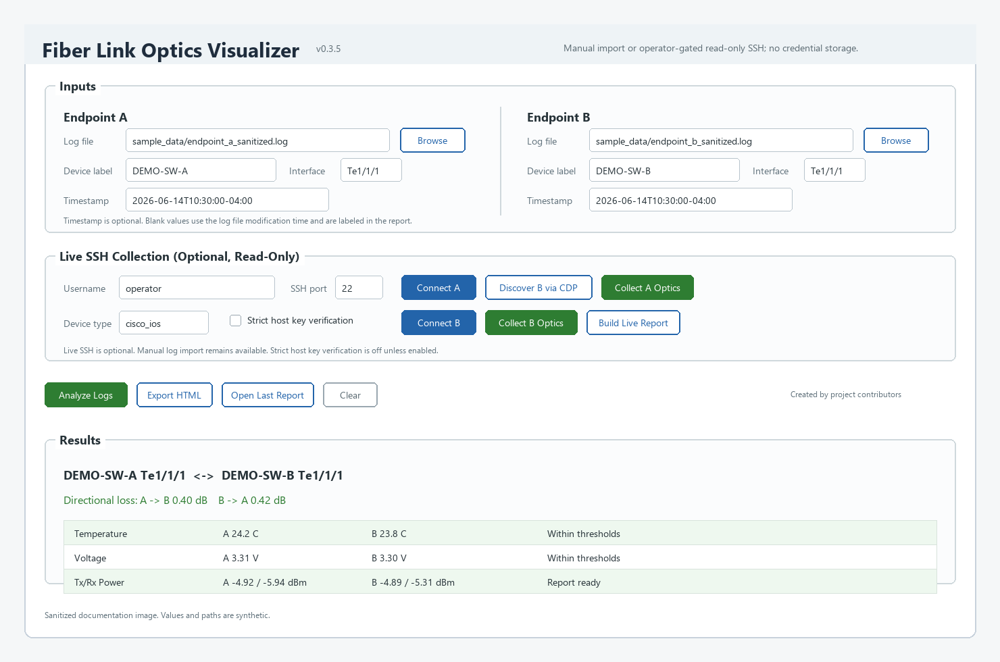
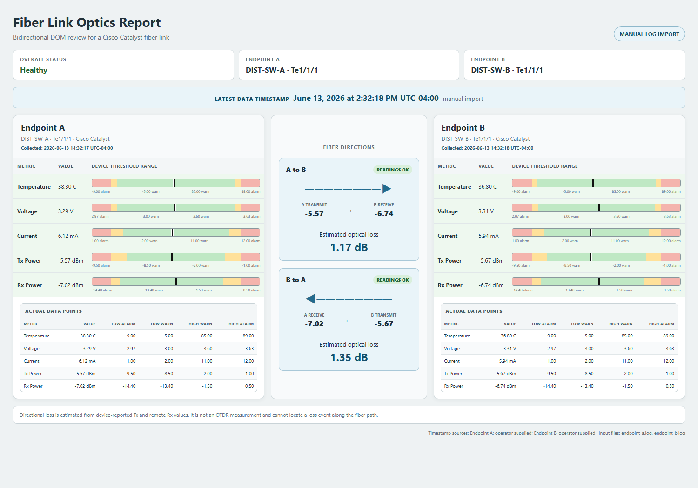

# Fiber Link Optics Visualizer

[](https://github.com/wmmunn/fiber-link-optics-visualizer-public/actions/workflows/tests.yml)
[](https://snyk.io/test/github/wmmunn/fiber-link-optics-visualizer-public?targetFile=requirements.txt)

A practical, operator-focused visualization of Cisco transceiver detail from both ends of a fiber link.

Fiber Link Optics Visualizer turns Cisco transceiver output from both
ends of a link into a self-contained HTML report. The default workflow imports
saved CLI output, and an optional read-only SSH workflow can collect the same
data from approved lab or operational environments.

The report places the two endpoint threshold graphs side by side with
bidirectional optical-loss estimates in the middle. It displays temperature,
voltage, bias current, transmit power, receive power, device thresholds, and
collection timestamps.





The images use synthetic readings and placeholder device labels. A complete browsable example is available
at [examples/dummy-report.html](examples/dummy-report.html).

## Version 0.3.5

This revision promotes the tested Nexus/CDP compatibility work into the
sanitized public package while keeping the repository source-only.

- Added Nexus-style `SFP Detail Diagnostics Information` parsing for row-based
  DOM tables.
- Added a supported-platform dropdown for live SSH collection and limited it
  to validated choices only.
- Routed Nexus live collection to `show int <interface> transceiver details`.
- Trimmed CDP-discovered B-side hostnames so domain suffixes or parenthetical
  trailer text do not interfere with SSH connection attempts.
- Normalized `Ethernet` and `Eth` interface names consistently across CDP,
  operator input, and parsed logs.
- Preserved the sanitized public scope with synthetic fixtures only and no
  binary artifacts committed to the repository.

See [HISTORY.md](HISTORY.md) for the revision log.

## Safety and Scope

- Manual log import remains the default workflow
- Optional read-only SSH collection
- Operator confirmation before live collection commands
- No credential collection or storage
- No device configuration changes
- Local HTML output

Directional loss is calculated from device-reported source Tx and remote Rx
values. It is an operational estimate, not an OTDR measurement, and the tool
does not impose a universal acceptable-loss threshold.

## Supported Input

The parser targets threshold-backed Cisco IOS, IOS-XE, and Nexus-style output
from commands such as:

```text
show interfaces <interface> transceiver detail
show int <interface> transceiver details
show interfaces transceiver detail
```

It supports common compact threshold tables, Nexus row-based SFP diagnostics,
and common Cisco interface names including `Gi`, `Te`, `Twe`, and `Eth`.

Optional CDP-assisted discovery uses:

```text
show cdp neighbors detail
```

The discovered endpoint pair is displayed for operator review before the tool
uses it.

## Quick Start

Python 3.10 or newer is required.

```powershell
python fiber_link_optics_visualizer.py
```

The desktop application uses standard Tkinter. Installing `ttkbootstrap` adds
the optional themed appearance:

```powershell
python -m pip install -e ".[gui]"
fiber-optics-gui
```

Install Netmiko only when you want to use the optional SSH workflow:

```powershell
python -m pip install -e ".[ssh]"
```

For dependency scanners that expect a classic Python manifest, `requirements.txt`
lists the optional GUI/SSH runtime dependencies.

In the GUI:

1. Select one sanitized or locally collected transceiver log for each endpoint.
2. Enter the endpoint labels and interfaces.
3. Optionally enter ISO 8601 collection timestamps with UTC offsets.
4. Select **Analyze Logs**.
5. Select **Export HTML** to create the report.

If a timestamp is omitted, the file modification time is used and identified
as such in the report.

## Optional Live SSH Workflow

Live SSH collection is designed as an operator-gated convenience, not a
replacement for approval, change-control, or local security policy.

The workflow is deliberately step-by-step:

1. Enter Endpoint A device, Endpoint A interface, expected Endpoint B device,
   SSH username, SSH port, and the matching `Device type` from the GUI
   dropdown. Supported live choices are `cisco_ios`, `cisco_xe`, and
   `cisco_nxos`.
2. Select **Connect A** and complete the interactive login flow.
3. Select **Discover B via CDP** to run `show cdp neighbors detail`.
4. Review and confirm the discovered B-side device and interface.
5. Select **Collect A Optics** and confirm the read-only transceiver command.
6. Select **Connect B** and complete the second interactive login flow.
7. Select **Collect B Optics** and confirm the read-only transceiver command.
8. Select **Build Live Report**, then **Export HTML**.

The live collector uses only:

```text
show cdp neighbors detail
show interfaces <interface> transceiver detail
show int <interface> transceiver details
```

When CDP discovery finds a B-side device name, the tool applies a sanitized
host value to the connect field by keeping the base hostname and dropping any
domain suffix or parenthetical trailer text.

MFA and interactive SSH behavior varies by environment. Some SSH gateways
present MFA prompts through the SSH session, while others require VPN, jump
hosts, management subnets, or access controls outside this tool. If the SSH
server cannot be reached, MFA prompts will not appear. Manual import remains
the fallback path.

## Sample Data

Synthetic files are included:

```text
sample_data/endpoint_a_sanitized.log
sample_data/endpoint_b_sanitized.log
```

They contain no live device data. Use interface `Te1/1/1` for both samples.

## Command Line

```powershell
python -m fiber_optics `
  --a-log "sample_data\endpoint_a_sanitized.log" `
  --a-device "LAB-SW-A" `
  --a-interface "Te1/1/1" `
  --a-collected-at "2026-01-15T10:30:17-05:00" `
  --b-log "sample_data\endpoint_b_sanitized.log" `
  --b-device "LAB-SW-B" `
  --b-interface "Te1/1/1" `
  --b-collected-at "2026-01-15T10:30:18-05:00" `
  --output "reports\fiber-link-report.html"
```

## Tests

```powershell
python -m unittest discover -s tests -v
```

All committed fixtures must remain synthetic and sanitized.

## Windows Executable

Install the build dependencies and use the included PyInstaller specification:

```powershell
python -m pip install -e ".[build]"
pyinstaller --noconfirm --clean fiber_link_optics_visualizer.spec
```

The windowed executable is written to
`dist\FiberLinkOpticsVisualizer.exe`. Executables and build artifacts are not
committed.

The public repository intentionally distributes source code, sanitized sample
data, and reproducible packaging metadata. Published binaries are left to the
operator because local signing and trust requirements vary by environment.

## Privacy

Generated reports contain the endpoint names, interfaces, timestamps, input
filenames, or live command labels entered by the operator. Review reports
before sharing them. Keep raw operational logs in an ignored local `input/`
directory.

## License

MIT. See [LICENSE](LICENSE).

Cisco, Catalyst, IOS, and IOS-XE are trademarks of Cisco Systems, Inc. This
project is independent and is not affiliated with or endorsed by Cisco.

